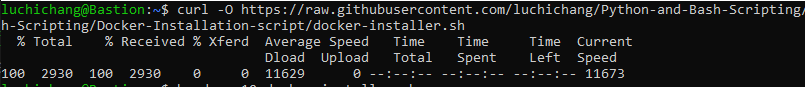
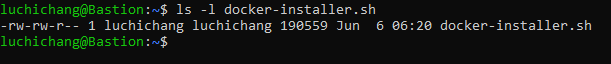
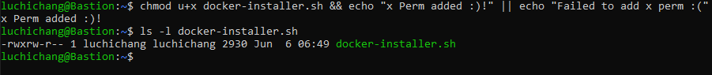
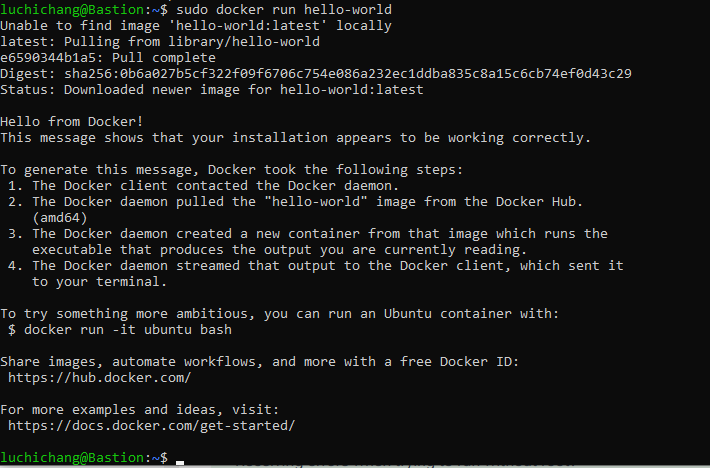
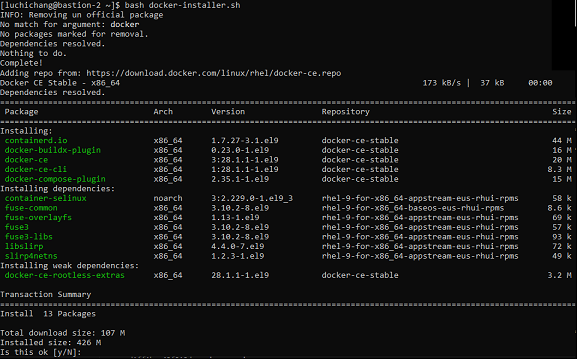
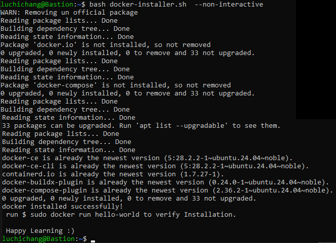
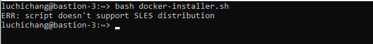

# Docker Installation Script

## Description,
   This script will install official **docker engine** and **docker compose** individually for ubuntu, cent os, debian, and centos distribution

## Flow Chart

<P align="center">

</p>
<!--  -->


## Execution 

- get the specfic file in to your working machine by running,
```
curl -O https://raw.githubusercontent.com/luchichang/Python-and-Bash-Scripting/refs/heads/main/Bash-Scripting/Docker-Installation-script/docker-installer.sh
```



- check the file permission and ensure it has execution permission either for user or groups or others. by running,
```
ls -l docker-installer.sh
```

<p align="center">

</p>
<!--  -->

- do this only if ***your file doesn't have execute perm***, 
```
chmod u+x docker-installer.sh && echo "x perm Added :)!" || echo "Failed Adding x perm :("
```



- run the script using `bash docker-installer.sh`

- Hurrah :tada: now official docker package is installed in the desired system. you can check everything works fine by running 
```
sudo docker run hello-world
```



### note,

script supports option if you intended to run the script manually then no option is needed.



whereas, for ***non-interactive*** purpose you can run the script in following way 
```
bash docker-installer.sh --non-interactive
```

<p align="center">

</p>


## Troubleshoot


